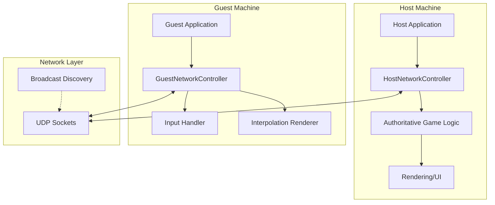
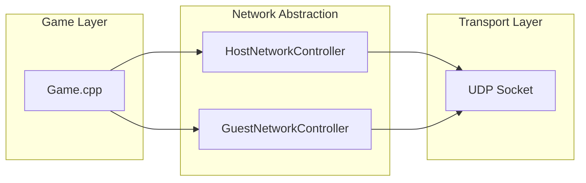
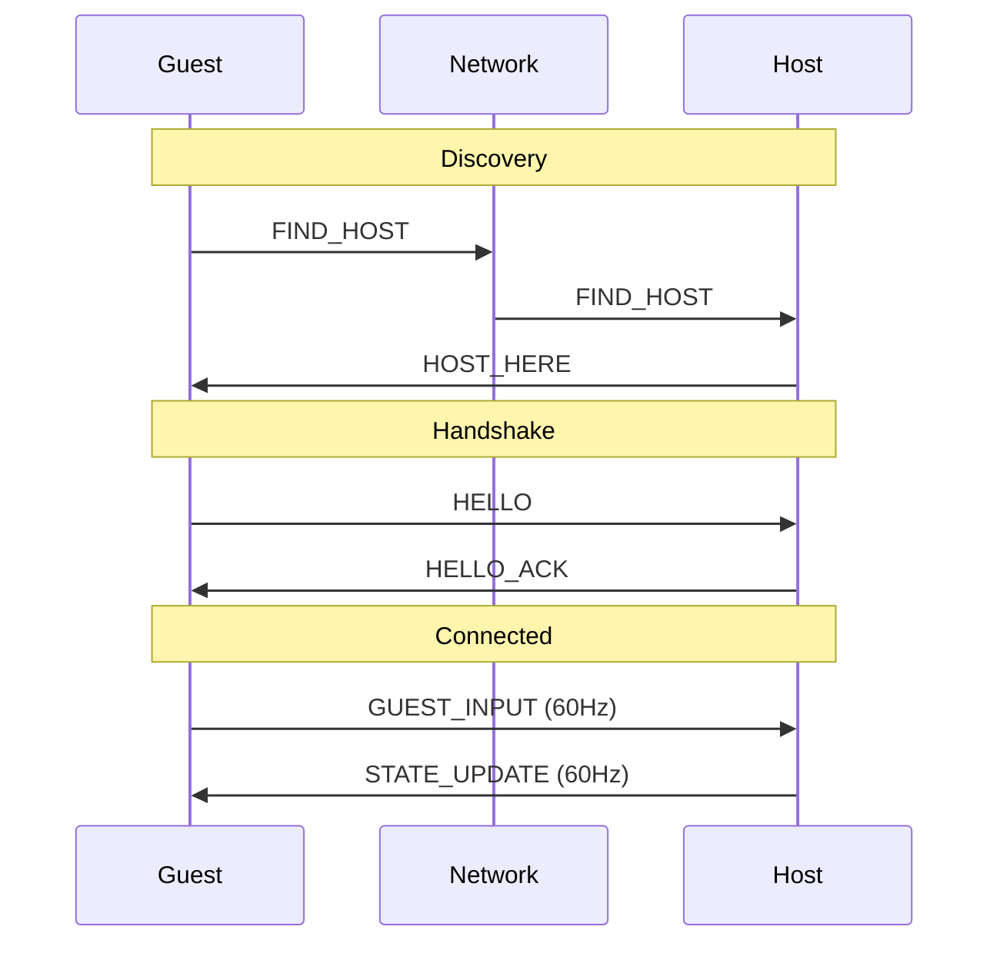
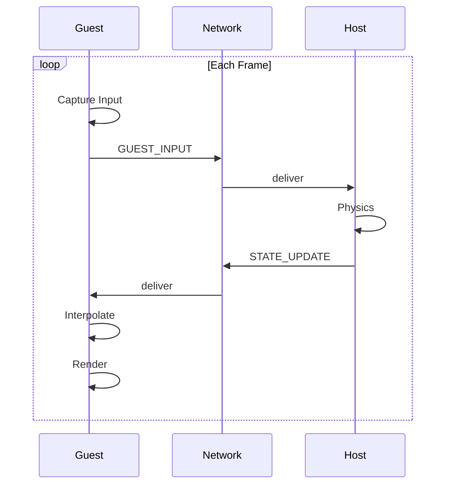
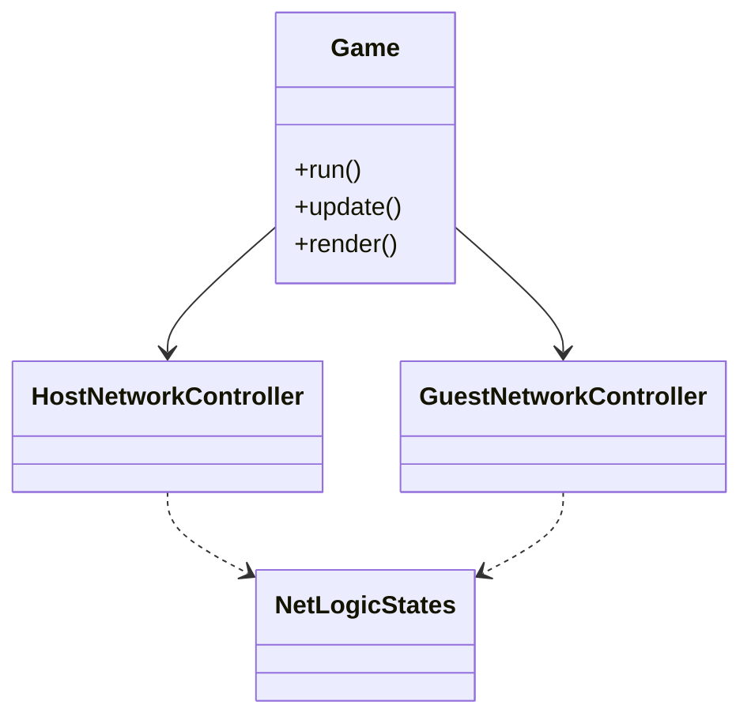
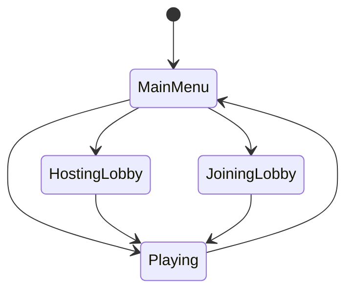

# Networked Pong – Design Report

## Table of Contents

1. [Project Overview](#project-overview)
2. [System Architecture](#system-architecture)
3. [Network Protocol Design](#network-protocol-design)
4. [Connection Establishment](#connection-establishment)
5. [Gameplay Synchronization](#gameplay-synchronization)
6. [Code Structure & Modularity](#code-structure--modularity)
7. [Error Handling & Recovery](#error-handling--recovery)
8. [Performance Analysis](#performance-analysis)
9. [Testing & Validation](#testing--validation)
10. [Conclusion](#conclusion)
11. [Appendices](#appendices)

---

## Project Overview

### Introduction

This project implements a real-time networked Pong game using UDP sockets and a client–server model. Key capabilities include:

* UDP-based communication
* Server-authoritative state
* Client-side interpolation
* Fixed-size binary protocol
* Automatic LAN host discovery

### Technology Stack

* **Language:** C++17
* **Graphics:** SFML 3.0
* **Transport:** UDP
* **Architecture:** Client–Server

---

## System Architecture

### High-Level Architecture



### Component Roles

#### Host

* Authoritative physics and scoring
* Processes guest input
* Broadcasts state at 60Hz
* Responds to discovery and handshake

#### Guest

* Sends input commands
* Receives authoritative state
* Interpolates for smooth rendering
* Renders only; no physics

### Network Layer Separation



This modular design supports clean interfaces, portability, and isolated testing.

---

## Network Protocol Design

### Message Types

| Message      | ID | Direction         | Purpose                |
| ------------ | -- | ----------------- | ---------------------- |
| FIND_HOST    | 1  | Guest → Broadcast | Discover hosts         |
| HOST_HERE    | 2  | Host → Guest      | Announce availability  |
| HELLO        | 3  | Guest → Host      | Initiate handshake     |
| HELLO_ACK    | 4  | Host → Guest      | Confirm handshake      |
| GUEST_INPUT  | 5  | Guest → Host      | Paddle movement        |
| STATE_UPDATE | 6  | Host → Guest      | Full game state update |

### Packet Formats

#### FIND_HOST (1 byte)

```
Byte 0: 0x01
```

#### HOST_HERE (3 bytes)

```
Byte 0: 0x02
Byte 1–2: Host port (uint16 BE)
```

#### HELLO (3 bytes)

```
Byte 0: 0x03
Byte 1–2: Guest port (uint16 BE)
```

#### HELLO_ACK (1 byte)

```
Byte 0: 0x04
```

#### GUEST_INPUT (4 bytes)

```
Byte 0: 0x05
Byte 1–2: Reserved timestamp
Byte 3: Input (-1, 0, 1)
```

#### STATE_UPDATE (31 bytes)

```
Byte 0:  Message Type
Byte 1–4: Sequence Number
Byte 5–8: Player 1 Y
Byte 9–12: Player 2 Y
Byte 13–16: Ball X
Byte 17–20: Ball Y
Byte 21–24: Ball Vel X
Byte 25–28: Ball Vel Y
Byte 29: P1 Score
Byte 30: P2 Score
```

### Protocol Rationale

* **UDP** for minimal latency, no retransmission delays.
* **Binary encoding** to minimize bandwidth.
* **Big-endian integers** for cross-platform consistency.

---

## Connection Establishment

### Discovery & Handshake



### Discovery Logic

* Broadcasts limited to once every 5 seconds.
* Non-blocking sockets to keep UI responsive.
* Clear state machine: discovery → handshake → connected.

### Host HELLO Processing

Correct offset handling prevents deserialization errors.

---

## Gameplay Synchronization

### Communication Loop



### Server-Authoritative Model

Ensures the guest cannot manipulate game state and prevents desync.

### Client-Side Interpolation

Interpolation smooths irregular packet arrival.

```cpp
m_interpAlpha += dt;
float p1Y = lerp(prev.p1Y, curr.p1Y, m_interpAlpha);
```

Key safeguards:

* Time-based interpolation
* Sequence number checks
* Drift prevention when alpha reaches 1.0

---

## Code Structure & Modularity

### Class Overview



### File Layout

```
Pong/
  Game.*
  HostNetworkController.*
  GuestNetworkController.*
  NetLogicStates.h
  MessageTypes.h
```

### State Machine



---

## Error Handling & Recovery

### Strategies

| Issue                | Strategy                       |
| -------------------- | ------------------------------ |
| Packet loss          | Continue with last valid state |
| Out-of-order packets | Sequence checks                |
| Corrupted packets    | Size/type validation           |
| Timeouts             | Retry discovery every 5s       |
| Binding failure      | Display user error             |

### Offset Bug and Fix

Correct offset advancement prevents float corruption.

---

## Performance Analysis

### Bandwidth

| Packet       | Size | Rate  | Bandwidth     |
| ------------ | ---- | ----- | ------------- |
| GUEST_INPUT  | 4 B  | 60 Hz | 240 B/s       |
| STATE_UPDATE | 31 B | 60 Hz | 1.86 KB/s     |
| **Total**    | —    | —     | **~2.1 KB/s** |

### Latency (LAN)

* Input → Display: **5–10 ms**
* Smooth rendering via interpolation

### Frame Rate Independence

Physics runs at fixed 60Hz regardless of render speed.

---

## Testing & Validation

| Test         | Expected          | Result |
| ------------ | ----------------- | ------ |
| Discovery    | Host found <5s    | Pass   |
| Handshake    | ACK received      | Pass   |
| Packet loss  | Smooth gameplay   | Pass   |
| Out-of-order | Ignored correctly | Pass   |
| Win state    | Synced            | Pass   |
| Disconnect   | Clean return      | Pass   |

---

## Conclusion

### Achievements

* Robust UDP networking
* Server authority
* Smooth interpolation
* Efficient binary protocol
* Clean architecture

### Future Enhancements

* Adaptive interpolation
* Client-side prediction
* Multi-client support
* NAT traversal
* Delta compression

---

## Appendices

### Appendix A: Message Enumeration

```cpp
enum MessageTypes : uint8_t {
    FIND_HOST = 1,
    HOST_HERE = 2,
    HELLO = 3,
    HELLO_ACK = 4,
    GUEST_INPUT = 5,
    STATE_UPDATE = 6
};
```

### Appendix B: Running the Application

**Host:** Online Mode → Host
**Guest:** Online Mode → Join
Both players use W/S or Arrow Keys; ESC returns to menu.

---
