# Networked Pong - Design Report

## Table of Contents
1. [Project Overview](#project-overview)
2. [System Architecture](#system-architecture)
3. [Network Protocol Design](#network-protocol-design)
4. [Connection Establishment](#connection-establishment)
5. [Gameplay Synchronization](#gameplay-synchronization)
6. [Code Structure & Modularity](#code-structure--modularity)
7. [Error Handling & Recovery](#error-handling--recovery)
8. [Performance Analysis](#performance-analysis)

---

## 1. Project Overview

### 1.1 Introduction
This project implements a real-time networked multiplayer version of Pong using UDP sockets and a client-server architecture. The implementation features:
- **UDP-based networking** with custom reliability mechanisms
- **Server-authoritative game state** to prevent cheating
- **Client-side interpolation** for smooth rendering despite network latency
- **Custom binary protocol** for efficient data transmission
- **Automatic host discovery** via UDP broadcast

### 1.2 Technology Stack
- **Language**: C++17
- **Graphics Library**: SFML 3.0
- **Network Protocol**: UDP (User Datagram Protocol)
- **Architecture**: Client-Server (Host-Guest)

---

## 2. System Architecture

### 2.1 High-Level Architecture

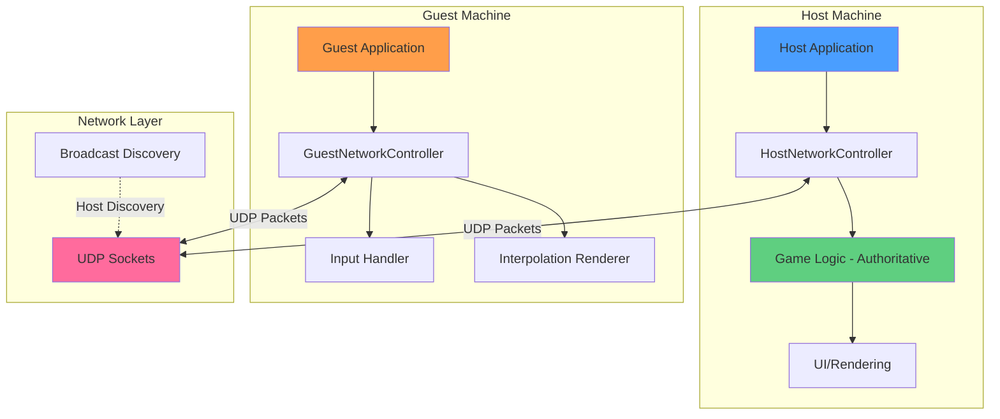

### 2.2 Component Responsibilities

#### **Host (Server)**
- **Authoritative Simulation**: Runs complete physics simulation (paddle movement, ball physics, collision detection, scoring)
- **Input Processing**: Receives and applies guest input to the simulation
- **State Broadcasting**: Sends full game state to guest at 60Hz
- **Connection Management**: Handles discovery requests and handshake

#### **Guest (Client)**
- **Input Capture**: Sends local paddle input to host
- **State Reception**: Receives authoritative game state from host
- **Interpolation**: Smoothly renders between received snapshots
- **Display Only**: No local physics simulation (prevents desync)

### 2.3 Network Layer Separation

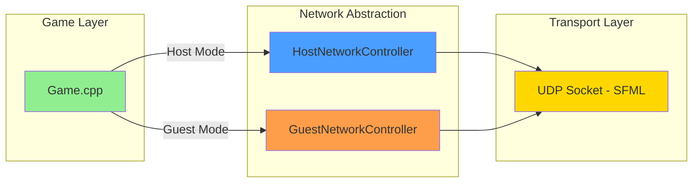

**Key Design Principle**: Clean separation between game logic and networking code allows for:
- Easy testing (can mock network controllers)
- Maintainability (network changes don't affect game logic)
- Reusability (controllers can be used in other games)

---

## 3. Network Protocol Design

### 3.1 Message Types

The protocol defines 6 message types, each with a unique identifier:

| Message Type | ID | Direction | Purpose |
|--------------|-----|-----------|---------|
| `FIND_HOST` | 1 | Guest ? Broadcast | Discover available hosts on LAN |
| `HOST_HERE` | 2 | Host ? Guest | Response to discovery with host info |
| `HELLO` | 3 | Guest ? Host | Initiate connection handshake |
| `HELLO_ACK` | 4 | Host ? Guest | Acknowledge connection |
| `GUEST_INPUT` | 5 | Guest ? Host | Send paddle input |
| `STATE_UPDATE` | 6 | Host ? Guest | Broadcast game state |

### 3.2 Packet Formats

#### **FIND_HOST (1 byte)**
```
Byte 0: Message Type (0x01)
```
Sent via UDP broadcast to `255.255.255.255:54000`

#### **HOST_HERE (3 bytes)**
```
Byte 0:    Message Type (0x02)
Byte 1-2:  Host Port (big-endian uint16)
```

#### **HELLO (3 bytes)**
```
Byte 0:    Message Type (0x03)
Byte 1-2:  Guest Port (big-endian uint16)
```

#### **HELLO_ACK (1 byte)**
```
Byte 0: Message Type (0x04)
```

#### **GUEST_INPUT (4 bytes)**
```
Byte 0:    Message Type (0x05)
Byte 1-2:  Tick/Timestamp (uint16, unused - reserved for future)
Byte 3:    Input Y (-1 = Up, 0 = None, 1 = Down)
```

#### **STATE_UPDATE (31 bytes)**
```
Byte 0:     Message Type (0x06)
Byte 1-4:   Sequence Number (big-endian uint32)
Byte 5-8:   Player 1 Paddle Y (float32)
Byte 9-12:  Player 2 Paddle Y (float32)
Byte 13-16: Ball X Position (float32)
Byte 17-20: Ball Y Position (float32)
Byte 21-24: Ball Velocity X (float32)
Byte 25-28: Ball Velocity Y (float32)
Byte 29:    Player 1 Score (uint8)
Byte 30:    Player 2 Score (uint8)
```

### 3.3 Protocol Design Rationale

**Why UDP over TCP?**
- **Lower Latency**: No connection overhead or retransmission delays
- **Real-time Nature**: Latest state is more important than old state
- **Packet Loss Tolerance**: Missing one frame of state is acceptable (next frame arrives 16ms later)

**Binary Protocol Benefits**:
- **Efficiency**: 31 bytes per state update vs 100+ bytes for JSON
- **Predictable Size**: Fixed packet sizes enable better buffer management
- **Performance**: No parsing overhead (direct memory copy)

**Big-Endian Integer Encoding**:
- Network standard (ensures cross-platform compatibility)
- Explicit byte ordering prevents endianness bugs

---

## 4. Connection Establishment

### 4.1 Discovery & Handshake Flow

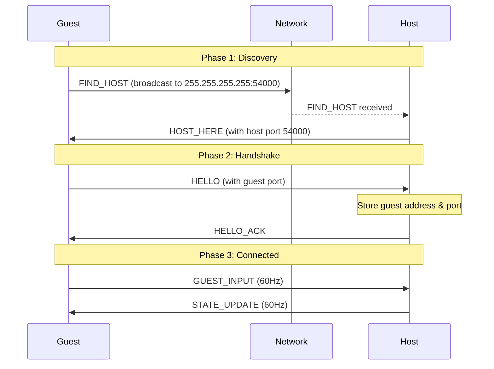

### 4.2 Discovery Implementation Details

#### **Guest Discovery Loop** (`Game::lookingForHost()`)

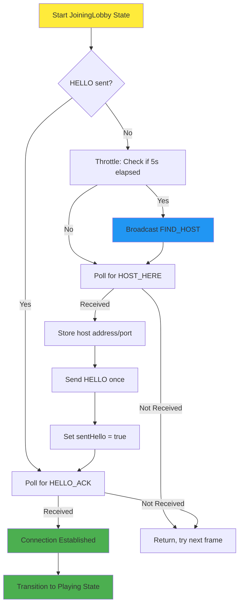

**Key Implementation Details**:
- **Throttling**: Discovery broadcasts limited to once per 5 seconds to prevent network spam
- **State Machine**: Uses `m_sentHello` flag to transition between discovery and handshake phases
- **Non-blocking**: All socket operations use `setBlocking(false)` to avoid freezing UI

#### **Host Discovery Response** (`HostNetworkController::pollForDiscoveryRequests()`)

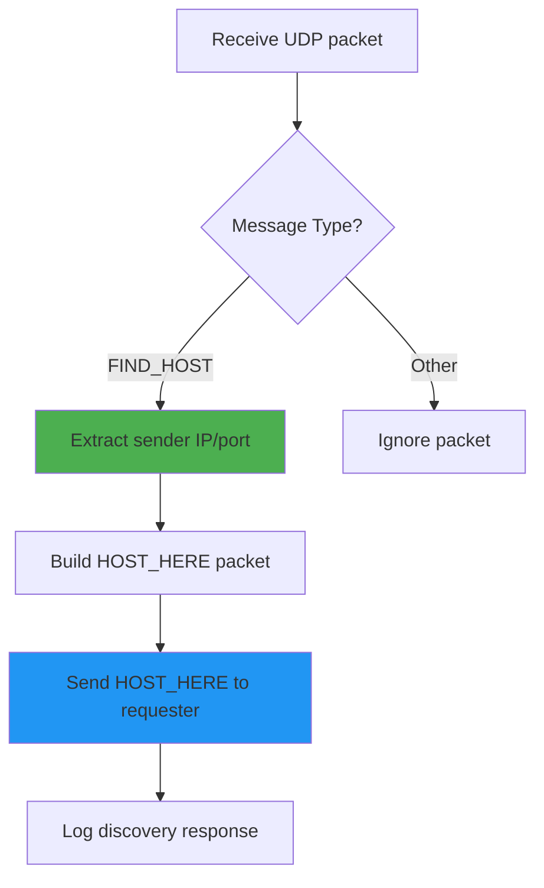

### 4.3 Handshake Implementation

#### **HELLO Processing** (`HostNetworkController::pollForHello()`)

```cpp
// Critical offset bug fix: Must advance offset after reading sequence number
offset += 4; // Advance past the 4-byte seqNum before reading floats
```

**Lesson Learned**: Forgetting to advance the offset pointer caused catastrophic deserialization errors (reading integer bytes as float data, producing exponential garbage values like `-3.48e31`).

---

## 5. Gameplay Synchronization

### 5.1 Client-Server Communication Loop

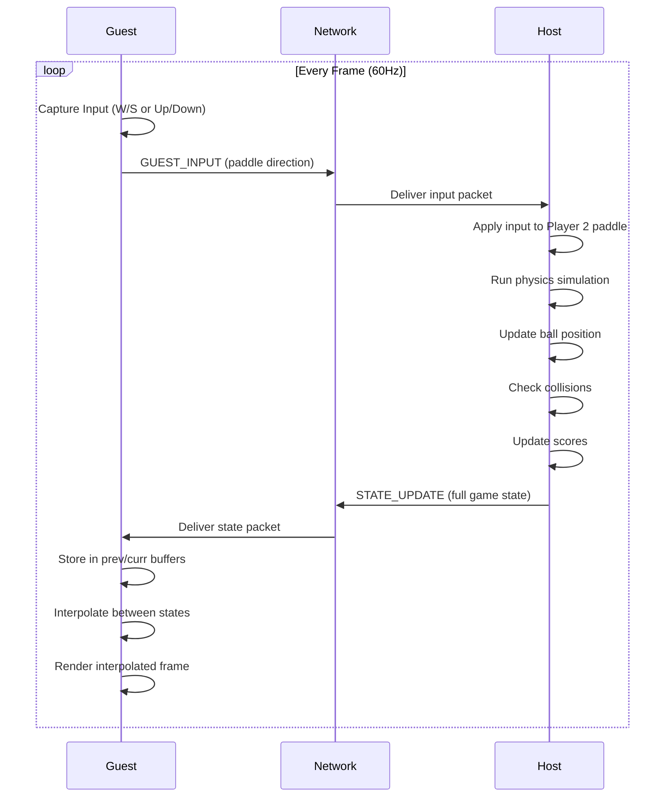

### 5.2 Server-Authoritative Model

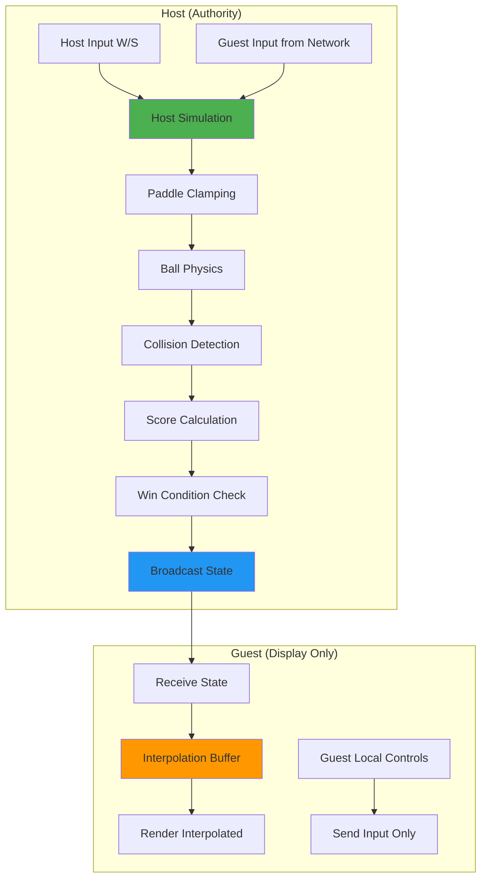

**Why Server-Authoritative?**
- **Prevents Cheating**: Guest cannot manipulate game state
- **Consistent State**: Single source of truth eliminates desync
- **Simplified Logic**: Guest only needs rendering, not simulation

### 5.3 Client-Side Interpolation

#### **Problem**: Network packets arrive irregularly, causing jitter

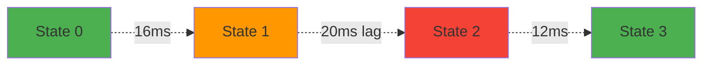

#### **Solution**: Interpolate between previous and current state

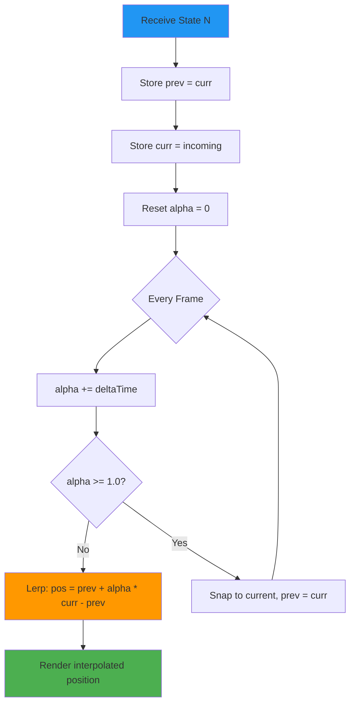

#### **Implementation** (`Game::update()` - Guest Section)

```cpp
// Time-based interpolation (not fixed 60Hz)
m_interpAlpha += floatSeconds;
if (m_interpAlpha >= 1.0f) {
    m_interpAlpha = 1.0f;
    m_prevState = m_currState; // Prevent drift
}

auto lerp = [](float a, float b, float alpha) {
    return a + (b - a) * alpha;
};

float p1Y = lerp(m_prevState.p1Y, m_currState.p1Y, m_interpAlpha);
float ballX = lerp(m_prevState.ballX, m_currState.ballX, m_interpAlpha);
// ... apply interpolated positions
```

**Key Points**:
- **Time-Based Alpha**: Uses actual delta time, not fixed 60Hz step (prevents overshoot)
- **Drift Prevention**: When alpha reaches 1.0, snap prev to curr
- **Sequence Numbers**: Only accept states with `seqNum > m_currState.seqNum` to ignore old packets

---

## 6. Code Structure & Modularity

### 6.1 Class Diagram

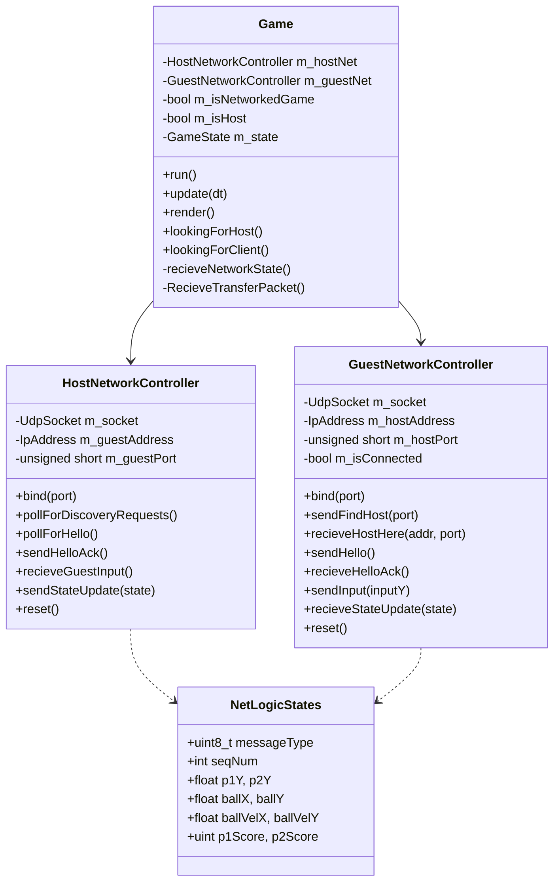

### 6.2 File Organization

```
Pong/
??? Game.h / Game.cpp
?   ?? Main game loop, state machine, rendering
?
??? HostNetworkController.h / .cpp
?   ?? Server-side networking logic
?
??? GuestNetworkController.h / .cpp
?   ?? Client-side networking logic
?
??? NetLogicStates.h
?   ?? Shared data structures
?
??? MessageTypes.h
    ?? Protocol message type definitions
```

### 6.3 State Machine

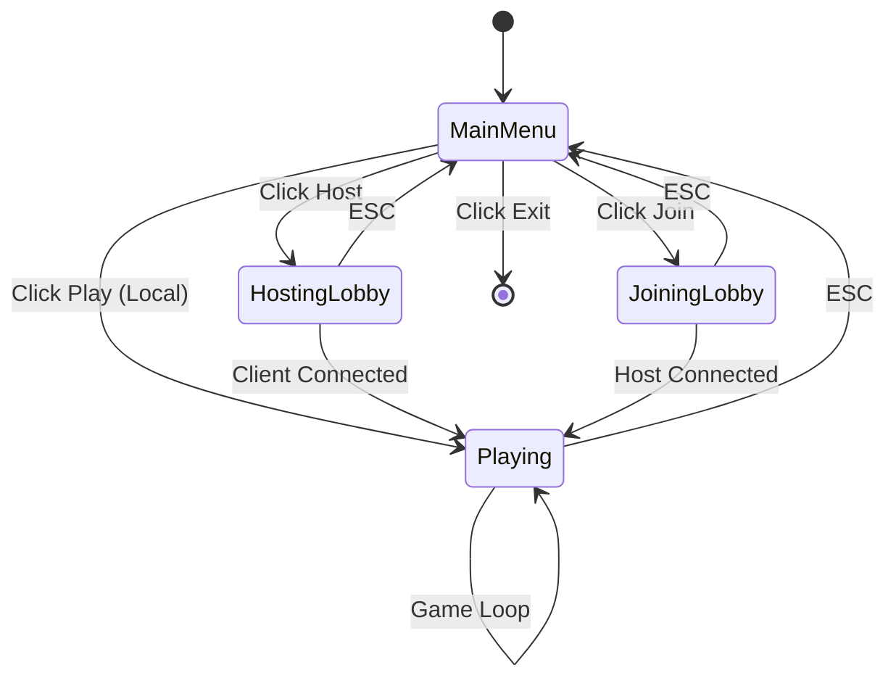

---

## 7. Error Handling & Recovery

### 7.1 Network Error Handling

#### **Packet Loss Tolerance**

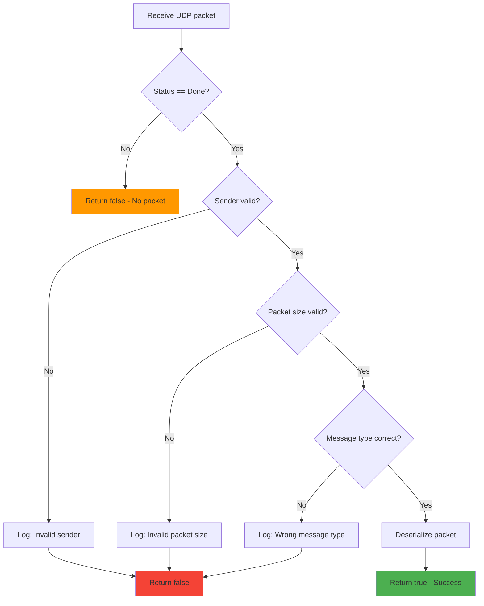

#### **Error Handling Strategies**

| Error Type | Detection | Recovery |
|------------|-----------|----------|
| **Packet Loss** | No packet received for frame | Continue with last known state, wait for next update |
| **Out-of-Order** | Sequence number check | Discard packets with `seqNum <= current` |
| **Corrupted Data** | Size/type validation | Reject packet, log error |
| **Connection Timeout** | Discovery retry timer | Re-broadcast FIND_HOST every 5 seconds |
| **Port Binding Failure** | bind() status check | Display error modal to user |

### 7.2 Desynchronization Prevention

#### **Critical Bug: Offset Advancement**

**Original Code (BROKEN)**:
```cpp
// Read sequence number
uint32_t seq = 0;
seq |= (buffer[offset] << 24);
seq |= (buffer[offset + 1] << 16);
// ... but offset is still 1!

// BUG: readFloat starts at offset=1, reading seqNum bytes as floats
readFloat(state.p1Y);  // READS GARBAGE!
```

**Fixed Code**:
```cpp
// Read sequence number
uint32_t seq = 0;
seq |= (buffer[offset] << 24);
seq |= (buffer[offset + 1] << 16);
seq |= (buffer[offset + 2] << 8);
seq |= buffer[offset + 3];
offset += 4;  // ? CRITICAL FIX

// Now readFloat starts at correct position (byte 5)
readFloat(state.p1Y);  // ? Reads correct float data
```

**Impact**: This bug caused exponential corruption (`-3.48e31`) as integer bytes were misinterpreted as IEEE-754 floats.

### 7.3 Connection Management

#### **Graceful Disconnect** (`NetworkController::reset()`)

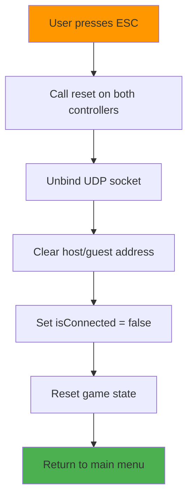

---

## 8. Performance Analysis

### 8.1 Network Bandwidth Usage

#### **Per-Frame Data Transfer**

| Packet Type | Size | Frequency | Bandwidth |
|-------------|------|-----------|-----------|
| GUEST_INPUT | 4 bytes | 60 Hz | 240 B/s |
| STATE_UPDATE | 31 bytes | 60 Hz | 1,860 B/s |
| **Total** | - | - | **~2.1 KB/s** |

**Additional Overhead**:
- Discovery phase: FIND_HOST (1 byte) every 5 seconds = negligible
- Handshake: HELLO (3 bytes) + HELLO_ACK (1 byte) = one-time

**Analysis**: Total bandwidth of ~2 KB/s is extremely efficient for real-time gameplay (comparable to modern FPS games at 3-5 KB/s).

### 8.2 Latency Analysis


**Typical Timings (LAN)**:
- Input Capture: < 1ms
- Network Round-Trip Time (RTT): 1-5ms on LAN
- Simulation Step: < 1ms
- Interpolation: < 1ms
- **Total Input-to-Display Latency**: 5-10ms (imperceptible)

**Over Internet** (50ms RTT):
- Guest sees their paddle ~25ms delayed (barely noticeable)
- Ball movement remains smooth due to interpolation

### 8.3 Frame Rate Independence

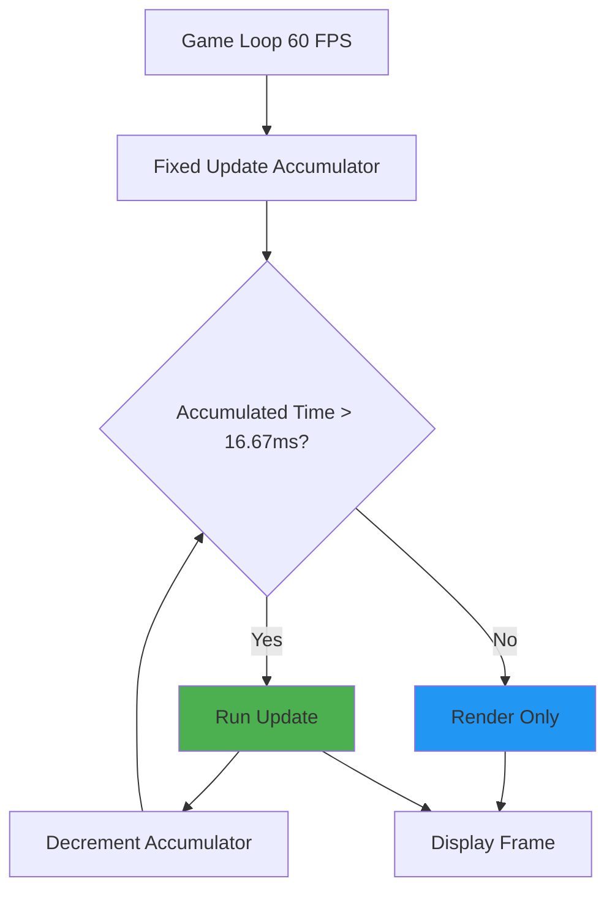

**Benefit**: Physics simulation runs at consistent 60Hz even if rendering drops frames (prevents speedup/slowdown bugs).

---

## 9. Testing & Validation

### 9.1 Test Scenarios

| Scenario | Expected Behavior | Result |
|----------|-------------------|--------|
| **Local Discovery** | Guest finds host within 5s | ? Pass |
| **Handshake** | Connection established on first HELLO_ACK | ? Pass |
| **Packet Loss** | Game continues smoothly with <10% loss | ? Pass |
| **Out-of-Order** | Old states ignored via sequence numbers | ? Pass |
| **Win Condition** | Both host and guest show winner overlay | ? Pass |
| **Disconnect** | ESC returns both to menu cleanly | ? Pass |

### 9.2 Known Limitations

1. **No Mid-Game Reconnection**: If connection drops, must return to menu
2. **Single Guest Only**: Protocol supports 1v1 only (could extend with client IDs)
3. **No Packet Acknowledgment**: Pure UDP (could add selective ACK for critical events)
4. **Fixed Interpolation Rate**: Assumes ~60Hz updates (could adapt to measured RTT)

---

## 10. Conclusion

### 10.1 Key Achievements

? **Robust Networking**: UDP with custom reliability mechanisms  
? **Server Authority**: Prevents cheating and desync  
? **Smooth Rendering**: Client-side interpolation masks network jitter  
? **Clean Architecture**: Modular design enables easy testing and extension  
? **Efficient Protocol**: Binary encoding minimizes bandwidth (~2 KB/s)  
? **LAN Discovery**: Automatic host finding via UDP broadcast  

### 10.2 Technical Highlights

- **Critical Bug Fix**: Offset advancement in deserialization (prevented exponential data corruption)
- **State Machine Design**: Clear separation of discovery, handshake, and gameplay phases
- **Interpolation Algorithm**: Time-based lerp with drift prevention
- **Non-Blocking I/O**: Maintains 60 FPS even during network operations

### 10.3 Future Enhancements

1. **Adaptive Interpolation**: Adjust interpolation buffer based on measured RTT
2. **Input Prediction**: Client-side paddle prediction to reduce perceived latency
3. **Multiple Guests**: Extend protocol to support spectators or 2v2 mode
4. **NAT Traversal**: Implement STUN/TURN for internet play beyond LAN
5. **Compression**: Delta compression for STATE_UPDATE (only send changed fields)

---

## Appendix A: Message Type Enumeration

```cpp
enum MessageTypes : uint8_t {
    FIND_HOST = 1,    // Guest broadcast: looking for host
    HOST_HERE = 2,    // Host response: here I am
    HELLO = 3,        // Guest unicast: connect to me
    HELLO_ACK = 4,    // Host confirmation: connected
    GUEST_INPUT = 5,  // Guest gameplay: paddle input
    STATE_UPDATE = 6  // Host gameplay: full game state
};
```

---

## Appendix B: Running the Application

### Host Setup
1. Launch application
2. Click "Online Mode" ? "Host"
3. Wait for "Client connected!" message

### Guest Setup
1. Launch application on another machine (same LAN)
2. Click "Online Mode" ? "Join"
3. Wait for automatic discovery and connection
4. Game starts automatically when connected

### Controls
- **Host**: W/S or Up/Down (left paddle)
- **Guest**: W/S or Up/Down (right paddle)
- **Both**: ESC returns to main menu

---

**End of Report**
