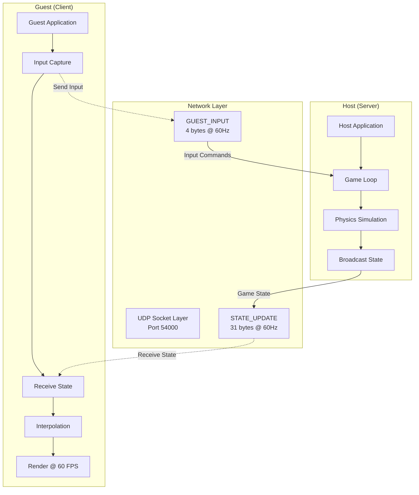
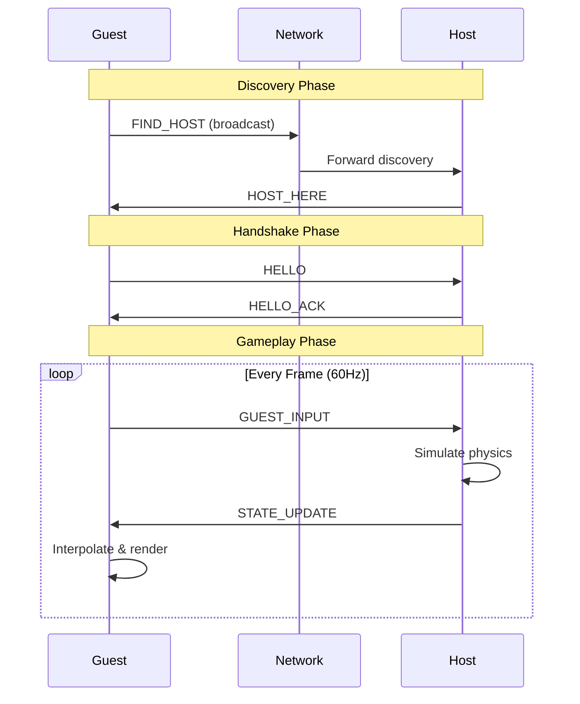

# Networked Pong

A real-time multiplayer Pong implementation featuring a server-authoritative architecture, UDP-based communication, and client-side interpolation for smooth gameplay over local networks.

---

## Table of Contents

* [Features](#features)
* [Architecture Overview](#architecture-overview)
* [Network Protocol](#network-protocol)
* [Getting Started](#getting-started)
* [How to Play](#how-to-play)
* [Technical Highlights](#technical-highlights)
* [Documentation](#documentation)
* [Known Limitations](#known-limitations)
* [Future Enhancements](#future-enhancements)
* [Testing Results](#testing-results)
* [Acknowledgments](#acknowledgments)
* [License](#license)
* [Author](#author)
* [Project Goals Achieved](#project-goals-achieved)

---

## Features

### Gameplay

* Real-time multiplayer Pong over LAN
* Smooth 60 FPS gameplay
* Single-player local mode

### Networking

* Automatic host discovery using UDP broadcast
* Server-authoritative physics simulation
* Client-side state interpolation
* Compact binary protocol (~2 KB/s)
* Tolerant of mild packet loss (<10%)

### User Experience

* Simple menu-driven interface
* Clean visual presentation (SFML)
* Intuitive controls (W/S or arrow keys)
* Graceful disconnect behavior

---

## Architecture Overview

### Client–Server Model



### Design Principles

1. Server hosts all physics and scoring logic.
2. Clients render interpolated server snapshots.
3. UDP transport for low-latency communication.
4. Clear separation of gameplay vs. networking modules.

---

## Network Protocol

### Message Types

| Message        | ID | Size     | Direction         | Purpose                  |
| -------------- | -- | -------- | ----------------- | ------------------------ |
| `FIND_HOST`    | 1  | 1 byte   | Guest → Broadcast | Host discovery           |
| `HOST_HERE`    | 2  | 3 bytes  | Host → Guest      | Discovery response       |
| `HELLO`        | 3  | 3 bytes  | Guest → Host      | Handshake initiation     |
| `HELLO_ACK`    | 4  | 1 byte   | Host → Guest      | Handshake confirmation   |
| `GUEST_INPUT`  | 5  | 4 bytes  | Guest → Host      | Paddle movement (60Hz)   |
| `STATE_UPDATE` | 6  | 31 bytes | Host → Guest      | Authoritative game state |

### Connection Flow



### STATE_UPDATE Packet Format (31 bytes)

```
Byte 0:     Message Type (0x06)
Byte 1-4:   Sequence Number (uint32)
Byte 5-8:   Player 1 Paddle Y (float32)
Byte 9-12:  Player 2 Paddle Y (float32)
Byte 13-16: Ball X (float32)
Byte 17-20: Ball Y (float32)
Byte 21-24: Ball Velocity X (float32)
Byte 25-28: Ball Velocity Y (float32)
Byte 29:    Player 1 Score (uint8)
Byte 30:    Player 2 Score (uint8)
```

---

## Getting Started

### Requirements

* C++17-compatible compiler (MSVC, GCC, Clang)
* SFML 3.0
* Windows, Linux, or macOS

### Building

#### Windows (Visual Studio)

```bash
git clone https://github.com/OlawoleAbayomi-Owodunni/pong-networking.git
cd pong-networking
start Pong.sln
```

Build via **Build Solution** and run using **Start Debugging**.

#### Linux/macOS (CMake)

```bash
sudo apt-get install libsfml-dev   # Ubuntu/Debian
brew install sfml                  # macOS

mkdir build && cd build
cmake ..
make

./Pong
```

---

## How to Play

### Hosting a Match

1. Launch the application.
2. Select **Online Mode**.
3. Choose **Host**.
4. Wait for a client to connect.
5. Match starts automatically.

### Joining a Match (Client)

1. Launch the application on another device on the same LAN.
2. Select **Online Mode**.
3. Choose **Join**.
4. Discovery and connection occur automatically.
5. Match begins immediately once connected.

### Controls

| Player               | Keys              |
| -------------------- | ----------------- |
| Host (Left Paddle)   | W/S or Arrow Keys |
| Guest (Right Paddle) | W/S or Arrow Keys |

### Game Rules

* First player to 5 points wins.
* Ball accelerates after paddle impacts.
* ESC returns to the main menu.

---

## Technical Highlights

### Server-Authoritative Simulation

* Host executes all physics and scoring.
* Client sends input only and renders the authoritative state.
* Prevents divergence and cheating.

### Client-Side Interpolation

```cpp
m_interpAlpha += deltaTime;
float p1Y = lerp(prevState.p1Y, currState.p1Y, m_interpAlpha);
float ballX = lerp(prevState.ballX, currState.ballX, m_interpAlpha);
```

Ensures smooth output even when packets arrive irregularly.

### Critical Offset Fix

```cpp
uint32_t seq = (buffer[offset] << 24) | ...;
offset += 4;  // Correct advancement
readFloat(state.p1Y);
```

Avoided float corruption by aligning reads correctly.

### Performance

| Metric                | Value     |
| --------------------- | --------- |
| Bandwidth             | ~2.1 KB/s |
| LAN Latency           | 5–10 ms   |
| Packet Loss Tolerance | <10%      |
| Frame Rate            | 60 FPS    |

---

## Documentation

### Design Report

See **DESIGN_REPORT.md** for detailed diagrams, protocol analysis, and validation.

### Code Layout

```
Pong/
  Game.h / Game.cpp
  HostNetworkController.*
  GuestNetworkController.*
  NetLogicStates.h
  MessageTypes.h
```

### Key Components

* **Game**: Manages state transitions and integrates rendering + networking.
* **HostNetworkController**: Handles discovery, handshake, input, and state broadcasting.
* **GuestNetworkController**: Performs discovery, connection, input transmission, and state reception.

---

## Known Limitations

* No mid-game reconnection
* Single-client support (1v1 only)
* LAN-only operation (no NAT traversal)
* No reliability layer beyond UDP

---

## Future Enhancements

* Adaptive interpolation based on RTT
* Paddle input prediction
* Support for multiple guests
* STUN/TURN for online play
* Delta compression for state updates
* Replay system

---

## Testing Results

| Test Case            | Expected                     | Result |
| -------------------- | ---------------------------- | ------ |
| Local Discovery      | Host found <5s               | Pass   |
| Handshake            | Successful on first exchange | Pass   |
| Packet Loss Behavior | Smooth under <10% loss       | Pass   |
| Out-of-Order Packets | Correctly ignored            | Pass   |
| Win State Sync       | Consistent on host & client  | Pass   |
| Disconnect Handling  | Returns to menu              | Pass   |

---

## Acknowledgments

* SFML — graphics and networking
* Mermaid.js — diagrams
* Gabriel Gambetta — networking articles

---

## License

Project developed for educational use within a networking course.

---

## Author

**Olawole Abayomi-Owodunni**
GitHub: [https://github.com/OlawoleAbayomi-Owodunni](https://github.com/OlawoleAbayomi-Owodunni)

---

## Project Goals Achieved

* Socket integration: 23%
* Game logic integration: 20%
* Protocol design: 8%
* Code structure: 5%
* Documentation: 15%
* Difficulty bonus: 10%
